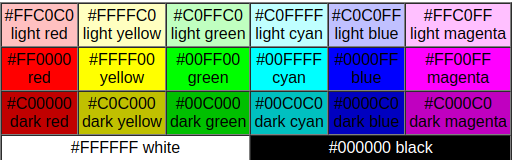

# **Piet интерпретатор**

### Piet — это язык программирования на изображениях. Вместо обычного текста код пишется цветными блоками. 

Интерпретатор должен понимать:
1) Цвета и блоки (codel'ы).
2) Переходы между блоками.
3) Команды, соответствующие цветовым переходам.
4) Направление движения (DP - dir_pointer) и выбор кода выхода (CC - cod_chooser).
5) Управление стеком.

#### **🎨 Как устроены цвета в Piet**

В языке Piet используется 18 командных цветов, которые организованы в сетку 
6 оттенков (hue) × 3 уровней яркости (lightness):
hue Цвет
0 Red
1 Yellow
2 Green
3 Cyan
4 Blue
5 Magenta

lightness Уровень
0 Light (светлый)
1 Normal (нормальный)
2 Dark (тёмный)

Например, 
curr_color = (0, 0)  # light red
next_color = (1, 1)  # normal yellow

### Использование
Сначала установите все необходимые библиотеки   
`pip install -r requirements.txt`

#### Вариант 1:
`python piet.py`  
Затем надо ввести путь до изображения  

#### Вариант 2
`python console_piet.py путь_до_изображения [-s размер_кодела] [-d] [-st]`  
Параметры:  
**--size, -s**: размер кодела

**--debug, -d**: режим отладки. Чтобы добавить брейкпоинты, добавьте в блок коделов пиксель с пониженной прозрачностью.
Если нет прозрачных пикселей, то каждый блок будет считаться брейкпоинтом.

**--step-by-step, -st**: выполнение по шагам, доступно только в режиме отладки.
После каждого брейкпоинта останавливает выполнение, пока пользователь не нажмёт ENTER